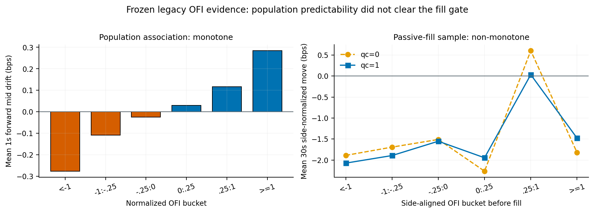

# L2 Market Microstructure System

[](https://github.com/pranavpillaiNUS/l2-mm-system/actions/workflows/tests.yml)
[](https://www.python.org/downloads/release/python-3110/)
[](report/l2_mm_system_complete_report.pdf)

A deterministic research system for reconstructing Binance BTCUSDT spot L2
order books, replaying market data, and simulating passive execution, with a
Python reference and an integrated C++17 order-book backend.

**Read the [complete project report (PDF)](report/l2_mm_system_complete_report.pdf)**
for the project's evolution, architecture, corrected research, native design,
validation, measurements, and limitations. [LaTeX source](report/v3/main.tex).

> **Research question:** Does a signal that predicts the next mid-price move
> remain useful after passive execution selects which states become fills?

**Author:** [Pranav Pillai](https://github.com/pranavpillaiNUS) · National
University of Singapore

## At a glance

- **System:** gap-aware L2 reconstruction, deterministic event merging, an
  event-driven replay clock, passive-order execution, and versioned research
  artifacts.
- **Execution model:** explicit entry and cancel latency, post-only arrival
  checks, partial fills, own-order FIFO, cancel/fill races, fee accounting, and
  worst-case working-exposure limits.
- **Research result:** strong population-level one-second OFI association with
  forward mid-price drift, but a failed pre-specified passive-fill screen for
  the tested market-making baseline.
- **Verification:** all 514 tests pass locally with raw data and the native
  build, alongside native CTest and sanitizer checks. Full output streams match
  across all 120 development hours at both queue endpoints (240 comparisons).
  Report generation and native parity are configured in CI.
- **Current status:** the corrected 24-window V3 study, integrated native hot
  path, and complete report are finished. Read the [V3 results](notebooks/research_writeup_v3.md)
  and [native design and measurements](cpp/README.md).
- **Native measurement:** 1.17–1.19× median speedup for the integrated replay
  and diagnostics on one development hour; 13.7× for the narrower standalone
  book-update benchmark. Both measurements retain their timing boundaries.

## Execution in one trace

The synthetic demo captures the private-order lifecycle and a cancel/fill race:

```text
0ms:placed -> 5ms:arrived -> 5ms:queued
6ms:cancel_requested -> 10ms:filled -> 11ms:cancel_too_late
```

The order reaches the book after modeled latency, joins the queue, receives a
cancel request, fills against recorded aggressor volume, and makes the delayed
cancel ineffective. This timing behavior is covered by the deterministic test
suite.

## Project status

| Layer | Status | What is established |
|---|---|---|
| Bar backtester | Educational precursor | Reusable interfaces, testing patterns, and research lessons |
| Frozen V2 study | Complete, historical | Auditable 24-window development evidence under the legacy execution model |
| Event-driven Python model | Implemented and tested | Deterministic private-event scheduling on the model clock, post-response-gated snapshot recovery, delayed cancels, own FIFO, volume conservation, gap handling, and risk invariants |
| V3 development study | Complete | Current-model baseline and conditional OFI evidence at both queue endpoints; the committed gate blocks candidate advancement |
| Holdout strategy evaluation | Strategy-sealed | Reserved for one candidate that clears development and enters with a locked protocol |
| Integrated C++17 backend | Complete | Native storage throughout replay and research entry points, full-stream parity on all 240 endpoint runs, measured pipeline performance; execution and accounting remain Python |

The frozen study and current simulator use distinct execution models. The
historical `legacy_book_update_v1` engine activated arrivals on the next depth
update and made cancellation requests effective immediately. The current
`event_driven_v2` engine schedules entries and cancels on the model clock,
models cancel/fill races, conserves aggressor volume across own FIFO, and gates
snapshot recovery on a post-response depth-receipt boundary. Each model writes
to its own artifact namespace.

The [decision protocol](notebooks/v3_development_protocol.md) was committed
before the V3 rerun. Both prospective hypotheses held: pooled population OFI
remained positive and fill-conditioned separation remained below the existing
`1.0 bps` bar at both queue endpoints. This completes the defined development
experiment without qualifying a candidate for holdout evaluation.

**Audit history:** The [error analysis](notebooks/error_analysis.md) records
successive corrections to post-only enforcement, UTC and stale-diff replay,
private-event scheduling, and snapshot-response timing. Each correction either
regenerated affected evidence or established an explicit model/version
boundary.

## Current research findings

V3 reran the same 24 development windows using the corrected execution and
snapshot policies. Each five-hour window sums five independently initialized
hourly episodes, with end-of-hour inventory marked to mid and reset.

| Measurement | No queue credit | Proportional queue credit |
|---|---:|---:|
| Mean net P&L, USDT/window | `-0.774` | `-0.978` |
| 95% window-bootstrap interval | `[-1.954, +0.182]` | `[-2.204, -0.081]` |
| Maker fills | `1,609` | `2,030` |
| 30s conditional OFI separation, bps | `-0.456` | `-0.064` |
| Diagnostic clustered 95% separation interval, bps | `[-1.497, +0.518]` | `[-0.904, +0.692]` |
| Predeclared conditional screen | Blocked | Blocked |

Normalized OFI has a positive one-second population coefficient in all 24
windows: pooled effect `+0.123285 bps/s.d.`, HAC `t = 64.6214`, and
`R² = 0.0365623`. That association does not clear the defined passive-fill
screen. The diagnostic intervals cross zero and condition on the selected
buckets; this is not a universal rejection of OFI or a backtest of the blocked
candidate. The 12-window holdout remains strategy-sealed.

The [V3 writeup](notebooks/research_writeup_v3.md) explains the protocol, source
freeze, uncertainty, and comparison with V2. The
[machine-readable summary](results/panels/btcusdt_l2_panel_v3_development_summary/summary.json)
links the verified evidence. V3 covers the two queue endpoints at 10 ms entry
and cancellation latency; the older intermediate-credit and latency grid below
remains historical.

## Historical V2 findings

The frozen V2 development panel contains 24 non-overlapping five-hour windows
from April–May 2026. It combines six exploratory anchors with 18 later windows
selected from a frozen integrity inventory; all 24 windows are treated as
development evidence.

The population and fill-conditioned views diverged. Normalized one-second OFI
had a positive coefficient in all 24 windows, while the 30-second
fill-conditioned response was non-monotone and failed the pre-specified
`1.0 bps` screen at both queue endpoints.

| Finding | Frozen result | Interpretation |
|---|---:|---|
| Baseline mean net P&L, no queue credit | `-0.686 USDT/window`, 95% CI `[-1.883, +0.290]` | Interval crosses zero |
| Baseline mean net P&L, proportional credit | `-1.043 USDT/window`, 95% CI `[-2.332, -0.032]` | Negative under this endpoint |
| Microprice, 1s effect | `+0.0190 bps/s.d.`, HAC `t = 1.74` | Missed significance and size screens |
| Normalized OFI, 1s effect | `+0.1233 bps/s.d.`, HAC `t = 64.63` | Strong population association; low `R² = 0.0366` |
| OFI fill-conditioned separation | `+0.127 bps` proportional / `-0.376 bps` no credit | Defined gate failed; response non-monotone |
| Queue-credit stress, matched net/BTC | `-9.75` to `-23.65 USDT/BTC` | More modeled queue credit increased fills but worsened economics |



The frozen protocol therefore blocked `OFIGatedMM` before strategy or holdout
evaluation. This establishes a strong historical population association and a
failed passive-fill screen for this baseline; other signal transforms and the
performance of the unrun candidate remain separate hypotheses. The 12-window
holdout is strategy-sealed: its identities and pre-strategy regime descriptors
are public, while strategy outcomes remain reserved for one
development-qualified, locked candidate.

The baseline's experimental parameterization uses 0.001 BTC quotes, a 0.01 BTC
maximum position, a 2 USDT half-spread, a five-second requote interval, 10 ms
modeled entry latency, and a 2 bps modeled maker fee. At a representative
71,500 USDT price, that half-spread is about 0.28 bps per side. The pooled
completed-lot break-even maker fee was 1.351 bps with no queue credit and 0.426
bps with proportional credit, making fees a structural hurdle in this
experiment.

These measurements were generated by `legacy_book_update_v1`. A publication
audit subsequently found that the legacy recorder tagged each REST snapshot
before its blocking request completed and replay applied the returned state at
that early tag. Across the 120 selected development hours, the first later local
depth receipt followed the tag by a median 250.5 ms (90th percentile 672.9 ms;
maximum 2,335 ms). Two no-credit and four proportional-credit frozen fills came
from orders placed before the selected policy boundary.

The committed
[`snapshot timing audit`](results/replay_correctness/snapshot_timing_panel24.json)
measures this observable exposure. V3 used
`post_response_proxy_depth_boundary_v1` and remeasured the development panel,
including queue-age and execution effects at the two locked endpoints.

## System design

The core flow is:

```text
depth snapshots/diffs + aggregate trades
                    |
           gap-aware parsers
                    |
     deterministic timestamp merger
                    |
          Decimal L2 order book
                    |
   replay engine <-> strategy intent
                    |
 event-driven execution + private scheduler
                    |
 P&L / markout / OFI / queue / tail analysis
                    |
       versioned, hashed artifacts
```

Engineering highlights:

- Snapshot bridging, stale-diff rejection, cross-file depth continuity, and
  aggregate-trade gap detection. Snapshot reconstruction is released only at a
  sequence-valid depth record known to follow response completion, or a
  defensible upper-bound proxy for legacy captures; only the final recovered
  state reaches strategy logic.
- Explicit equal-time rule: all recorded market data at a millisecond is
  processed before equal-time private arrivals.
- Post-only arrival checks, maker/taker fee assignment, partial fills, separate
  entry/cancel latency, and explicit late-cancel outcomes.
- Public queue plus non-overlapping own-order FIFO; aggregate simulated maker
  fills cannot exceed recorded aggressor volume.
- Fail-closed gap handling and snapshot resynchronization.
- Hard worst-case working-exposure limit across active orders, pending entries,
  and cancels in flight.
- `Decimal` accounting, seeded randomness, canonical state hashes, provenance
  guards, and separate frozen/current result roots.
- Window-level bootstrap inference, Newey-West standard errors, strict
  pre-fill signal anchoring, decision gates, and a lightweight artifact verifier.

The implementation is an offline research simulator over aggregate L2. It
estimates passive execution under explicit queue, timing, fee, and data
assumptions; exchange replication and live-trading controls are outside its
scope.

## Quick verification

Python 3.11 is the supported environment. Clone-level verification uses
committed and synthetic inputs:

```bash
python3.11 -m venv .venv
source .venv/bin/activate
python -m pip install -r requirements.txt
python -m pip install --no-deps --editable ".[analysis,dev]"

env PYTHONPATH=. pytest -q
env PYTHONPATH=. python scripts/demo_event_driven_execution.py
env PYTHONPATH=. python scripts/verify_v2_artifacts.py
```

A fresh checkout runs the committed and synthetic tests. Restoring the selected
raw captures and building C++ activate their corresponding integration checks.
Run `make cpp-test PYTHON=python` to build and verify the native implementation.
The demo verifies execution lifecycle mechanics. The V2 verifier checks committed
identities, artifact shapes, verdict fields, model separation, and the
strategy-sealed holdout boundary.

Verify V3's committed evidence without raw data:

```bash
env PYTHONPATH=. python scripts/verify_v3_artifacts.py --source-revision recorded --artifacts-only
```

This explicitly checks source bytes at the manifest's exact Git commit
`04df629`; later benchmark and verification tooling is separate. Omitting the
flag requires the current working source to match the recorded run.
Omit `--artifacts-only` to hash-check the restored raw captures as well. Completed
manifest trees reject further writes; use a new output root for a new run.

To use native storage in the working replay pipeline:

```bash
make cpp-test PYTHON=python
env PYTHONPATH=. python scripts/run_replay.py --book-backend cpp \
  --strategy microprice --date 2026-04-12 --hour 9 --hours 1 \
  --half-spread 2.00 --requote-interval-ms 5000 --write-results
```

The same backend flag is available in comparison, reconciliation, microprice,
OFI, and development-panel entry points. Native outputs use a `cpp` namespace
and retain native binary and backend provenance. With all selected raw files
restored, `make native-pipeline-check PYTHON=python` repeats all 240 comparisons.

## Documentation and reproducibility

The [complete report](report/l2_mm_system_complete_report.pdf), built from
[LaTeX source](report/v3/main.tex), covers the project end to end.
The [V3 writeup](notebooks/research_writeup_v3.md) gives a shorter current study;
the [August report](report/l2_mm_research_report.pdf) preserves the historical
V2 methodology, results, and failure analysis. Supporting references:
[data specification](DATA.md) · [result map](results/README.md) ·
[execution-model contract](notebooks/execution_model_v2.md).

There are three levels of reproduction:

1. **Clone-level:** run deterministic tests and the synthetic execution demo.
2. **Artifact-level:** inspect the committed V3 summary and manifest; validate
   the historical V2 summaries and rebuild their report figures and PDF.
3. **Full replay:** restore the selected raw files whose individual hashes are
   recorded in the integrity manifest. The 24-window development subset is 240
   spot files (824,383,459 bytes). Other locally captured files include unused
   perpetual-futures recordings and do not enter the selected experiment.

Raw market data is intentionally excluded from Git. See [DATA.md](DATA.md) for
schemas, directory layout, integrity rules, missingness, and exact boundaries.

To build the new full report from committed artifacts:

```bash
make complete-report PYTHON=python
make complete-report-check PYTHON=python
```

The report build is pinned in CI to Tectonic 0.17.0. Use an isolated virtual
environment with `requirements.txt`; the Matplotlib wheel's bundled FreeType
version matters for byte-identical PNG output. Report checks also use
Poppler (`pdfinfo`, `pdffonts`, and `pdftotext`) and uses `qpdf` when available.
The original `make report` and `make report-check` targets rebuild the historical
V2 report. Both reports are checked in CI without requiring raw captures.

## Repository guide

| Path | Purpose |
|---|---|
| [`src/replay/`](src/replay/) | L2 book, depth/trade parsers, event merge, replay clock |
| [`src/execution/`](src/execution/) | Orders, private scheduler, queue/FIFO model, fills and fees |
| [`src/strategies/`](src/strategies/) | Symmetric, microprice, and blocked OFI-gated quoting logic |
| [`src/analysis/`](src/analysis/) | P&L, markouts, signals, uncertainty, gates and diagnostics |
| [`scripts/`](scripts/) | Recording, replay, panel orchestration, analysis and verification |
| [`tests/`](tests/) | Deterministic unit, invariant, integration and artifact-contract tests |
| [`cpp/`](cpp/) | C++17 order-book library, CLI, parity contract, golden vectors, and native checks |
| [`results/panels/`](results/panels/) | Canonical selected derived artifacts by model namespace |
| [`notebooks/`](notebooks/) | Frozen protocols, historical writeups, research log and model note |
| [`report/`](report/) | LaTeX source, generated figures and compiled technical report |

The root `results/` tree also contains exploratory and superseded outputs. Use
the [result map](results/README.md) before citing a file.

## Evidence boundaries

- **Dataset:** one venue, one instrument, and a short, clustered April–May 2026
  research period.
- **Episode construction:** each nominal five-hour result sums five independently
  initialized one-hour episodes. Inventory is marked to session-end mid and
  reset with liquidation cost omitted, so the metric aggregates episodes rather
  than one continuous portfolio path.
- **Queue inference:** aggregate L2 exposes displayed quantity rather than order
  identities; true queue rank, hidden liquidity, and within-level order changes
  remain latent.
- **Event ordering:** queue-cancellation credit is uncalibrated. The model
  processes market data before private actions at equal timestamps, while true
  within-millisecond exchange ordering remains unobservable.
- **Snapshot clock:** V2 used a pre-fetch local tag. Current recovery combines a
  request-time barrier, post-response receipt order, depth event time `E`, and
  trade time `T`. This is an exchange-clock proxy; client-observation latency
  remains uncalibrated. V3 remeasures queue age and execution eligibility under
  the selected proxy policy.
- **Execution calibration:** the model omits separate market-data latency, live
  acknowledgement and fill calibration, endogenous impact, account-specific
  fee tiers, and hidden liquidity.
- **Selection:** 775 of 1,193 inventoried hours met every eligibility rule, and
  recording availability may be non-random.
- **Inference:** the diagnostic clustered interval conditions on the originally
  selected OFI buckets and assumes independent window clusters. It is not
  selection-adjusted; the count threshold is not a formal power calculation.

## Completed scope and extensions

The corrected development study, committed decision rule, verified artifact
manifest, integrated native backend, and full report are complete. A new signal hypothesis
would need a separate development protocol before candidate or holdout testing.
Extending the current-model sensitivity grid or porting the full replay and
execution engine would likewise be a separate versioned experiment or port.

The C++17 backend reproduces Python's book behavior on its fixed-eight-decimal
input domain. Python retains derived Decimal arithmetic, execution, and
accounting. The [full-panel parity artifact](results/native_pipeline/development_parity.json)
and [integrated measurements](results/native_pipeline/development_hour_benchmark.json)
validate this application boundary. Use `make cpp-benchmark` for the separate
book-only benchmark. See the
[native design note](cpp/README.md) for the arithmetic boundary and build steps.
